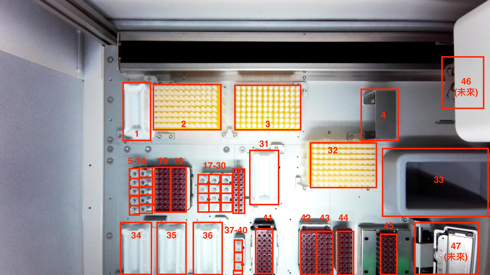

# genereach_aoi
> This is for a object detection problem. 
> Because its simplicity, I turn it into a binary classification problem in order to check if the reagent are set up.
> 
> If yes, then we can start to run the PCR process.
> If not, we will show the warning and ask the technician to set up again.
> Live demo [_here_](https://www.example.com). <!-- If you have the project hosted somewhere, include the link here. -->

## Table of Contents
* [General Info](#general-information)
* [Technologies Used](#technologies-used)
* [Features](#features)
* [Screenshots](#screenshots)
* [Setup](#setup)
* [Usage](#usage)
* [Project Status](#project-status)
* [Room for Improvement](#room-for-improvement)
* [Acknowledgements](#acknowledgements)
* [Contact](#contact)
<!-- * [License](#license) -->

## General Information
- OME cooperate with genereach in order to create a machine for PCR test. And this is the AOI(Automated Optical Inspection) part.
- This project tries to recognize if the reagent are placed in a ready position. 
- I am Leo, a summer intern for OME programming team. I am in charge of this AOI project.
<!-- You don't have to answer all the questions - just the ones relevant to your project. -->

## Technologies Used
- Tech 1 - version 1.0
- Tech 2 - version 2.0
- Tech 3 - version 3.0

## Database
- Take photos and store in google drive space.
- STEP:
- 1. Put reagent in half of the total blocks. And the other half is empty.
- 2. Take 250 images for "0" (empty), and 250 images for "1" (not empty) for each block. And 100 images for testing data!
- 3. Need to change the angle of the light source.

## Features
List the ready features here:
- **Image Preprocessing:** Find coordination of each block in our database, and split the block image as new data set. 
- **Data Labeling:** Label data from the dataset, define 0 or 1. This is an interactive ipynb file that we can finish all the labeling work.
- **Deep Learning Model Training:** Use the dataset and the labels to train a deep learning model based on CNN.

## Screenshots

<!-- If you have screenshots you'd like to share, include them here. -->

## Setup
What are the project requirements/dependencies? Where are they listed? A requirements.txt or a Pipfile.lock file perhaps? Where is it located?

Proceed to describe how to install / setup one's local environment / get started with the project.

## Usage
How does one go about using it?
Provide various use cases and code examples here.

`write-your-code-here`

## Project Status
Project is: _in progress_ / _complete_ / _no longer being worked on_. If you are no longer working on it, provide reasons why.

## Room for Improvement
Include areas you believe need improvement / could be improved. Also add TODOs for future development.

Room for improvement:
- Improvement to be done 1
- Improvement to be done 2

To do:
- Feature to be added 1
- Feature to be added 2

## Acknowledgements
Give credit here.
- This project was inspired by...
- This project was based on [this tutorial](https://www.example.com).
- Many thanks to...

## Contact
Created by [@flynerdpl](https://www.flynerd.pl/) - feel free to contact me!

<!-- Optional -->
<!-- ## License -->
<!-- This project is open source and available under the [... License](). -->

<!-- You don't have to include all sections - just the one's relevant to your project -->
